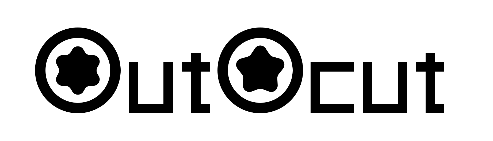

# OutoCut



AI-friendly video editor - The CLI tool for motion graphics and video editing.

**Made by BLOUplanet**

## Philosophy

OutoCut is built on a simple premise: **video editing should be as easy as writing code**.

Every aspect of your project is data. Every animation is reproducible. Every frame is deterministic.

## Core Principles

- **Everything is a Layer** - Video, audio, text, shapes, images - all are layers
- **Everything is Keyframable** - Time, value, easing - all can be animated
- **Everything supports Expression** - Use JavaScript-like expressions (`position.x = time * 50`)
- **Composition First** - Infinite pre-composition nesting
- **Deterministic Render** - Same JSON = 100% identical output
- **Vector-first** - Resolution-independent motion graphics with Cairo

## Installation

```bash
curl -sSL https://raw.githubusercontent.com/llaa33219/outocut/main/install.sh | bash
```

Or install from source:

```bash
git clone https://github.com/llaa33219/outocut.git
cd outocut
cargo build --release
sudo mv target/release/outocut /usr/local/bin/
```

## Quick Start

### 1. Create a Project

```bash
outocut validate my-project.outocut
```

### 2. Render to Video

```bash
outocut render project.outocut -o output.mp4
```

With GPU acceleration:

```bash
outocut render project.outocut -o output.mp4 --gpu
```

With custom quality settings:

```bash
outocut render project.outocut -o output.mp4 --preset slow --crf 18
```

### 3. Preview

```bash
outocut preview project.outocut --time 5.0
```

### 4. Watch Mode

```bash
outocut watch project.outocut
```

## CLI Commands

| Command | Description |
|---------|-------------|
| `render` | Render project to video file |
| `preview` | Preview project at specific time |
| `validate` | Validate project file |
| `export-json` | Export JSON with optional formatting |
| `watch` | Watch for changes and auto-reload |

## File Format

OutoCut projects are pure JSON files with `.outocut` extension. They support comments:

```json
{
  // This is a comment
  "version": "1.0",
  /* Multi-line
     comment */
  "settings": {
    "width": 1920,
    "height": 1080,
    "fps": 30
  }
}
```

See [File Format Specification](https://github.com/llaa33219/outocut/blob/main/ai-docs/usage/file-format.md) for complete documentation.

## Features

### Layer Types
- **video** - Video footage
- **audio** - Audio tracks
- **image** - Static images
- **text** - Animated text layers
- **shape** - Vector shapes (rect, ellipse, star, polygon)
- **solid** - Color solid layers
- **null** - Parent layers for grouping
- **adjustment** - Effect adjustment layers
- **composition** - Pre-composed layers

### Animation System
- 20+ easing functions (linear, easeIn, easeOut, elastic, bounce, cubic-bezier)
- Keyframe interpolation
- Expression support (planned for v1.1)

### Effects
- Color correction (RGB, saturation, brightness, contrast, gamma, levels, curves)
- Blur (Gaussian, directional, radial)
- Transform (crop, rotate, flip, perspective)
- Styling (drop shadow, glow, vignette)
- And more...

### Blend Modes
normal, multiply, screen, overlay, darken, lighten, colorDodge, colorBurn, hardLight, softLight, difference, exclusion, hue, saturation, color, luminosity, add, subtract, divide

## Requirements

- Rust 1.75+
- FFmpeg (for video encoding)

## License

Apache License 2.0 - See [LICENSE](LICENSE) for details.

Copyright (c) 2026 BLOUplanet
